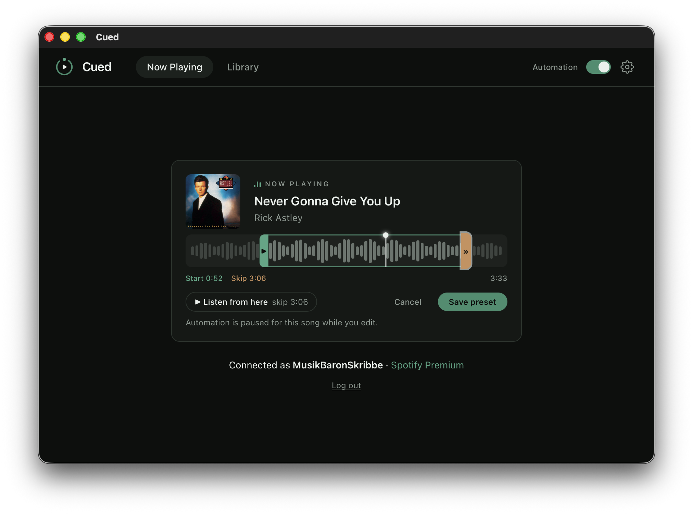

  

# Cued

**Per-song start & skip presets for Spotify.** Some songs have a minute of
intro you never want to hear; some outros overstay their welcome. Cued lets you
set a custom start point and skip point for any track — once — and then applies
them automatically every time the song comes on, by remote-controlling the
Spotify app you already listen with. No playlists to rebuild, no edited files,
no interference with how you listen.

## Features

- **Start & skip points per song** — drag two handles on a timeline, done.
  The song starts where you want and leaves before it drags.
- **Fully automatic** — presets apply on their own while you listen, even
  across natural track changes. One master switch turns all automation off.
- **Preview by ear** — listen from any point before you save it.
- **Suggestions from your own listening** — Cued notices where you usually
  skip or jump within a song and quietly offers a matching preset. One click
  to apply, one click to undo. Songs you almost always skip can be
  auto-skipped entirely.
- **Skip heatmap** — the timeline shades the parts of a song you tend to
  skip, so you can see your own habits at a glance.
- **Library** — every preset in one searchable list, editable inline.
- **Menu-bar app** — close the window and Cued keeps working quietly from
  the menu bar.
- **Private by design** — presets and listening history live only on your
  computer. Nothing is uploaded, ever, and you can delete it all in Settings.

## Requirements

> - **macOS 13 or newer**
> - **Spotify Premium** — Spotify only allows playback control on Premium
>   accounts; Cued cannot work around that.
> - **A free Spotify Client ID** — your personal API key. The in-app wizard
>   walks you through creating one; it takes about 3 minutes, once.

## Install

1. Download the latest `.dmg` from the
   [Releases](../../releases) page.
2. Open it and drag **Cued** into **Applications**.
3. First launch only: **right-click `Cued.app` → Open → Open**. The build is
   not yet notarized with Apple, so macOS asks once; after that it opens
   normally.
4. Follow the in-app setup — Cued guides you through connecting your Spotify
   account step by step.

## FAQ

**Why do I need my own Spotify Client ID?**
Cued is free, open source, and has no server. Spotify's API requires every
app to register for an access key, and keys registered by an app maker come
with strict user limits — so instead, each Cued user creates their own free
key on Spotify's developer site. The in-app wizard walks you through it
click by click; no coding involved, and the key stays tied to your own
Spotify account.

**Does Cued upload or share anything?**
No. Presets and listening insights are stored in a local database on your
computer, and Cued talks to exactly one service: Spotify's API, to read and
control your playback. There are no analytics, no accounts, no tracking, and
you can delete all collected data anytime in Settings.

**Will Cued ever touch my volume?**
No. Cued only repositions playback — it seeks and skips. It never changes
your volume, and it never plays audio itself.

**Why is the timing accurate to about a second, not the millisecond?**
Cued steers the Spotify client from the outside, over Spotify's own API. It
watches playback about once a second and wakes up just before a start or
skip point, which lands actions within roughly ±1 second — exactly right for
trimming intros and outros, though not for beat-perfect cuts.

## Support

Cued is free and always will be — if it made your listening better, a
[tip on Ko-fi](https://ko-fi.com/phinorsk) or a star on this repo is
appreciated, but never expected.

## License

[MIT](LICENSE) © Phil Skribbe

---

Cued is an independent project. It is not affiliated with, endorsed by,
or sponsored by Spotify. Spotify is a trademark of Spotify AB.
